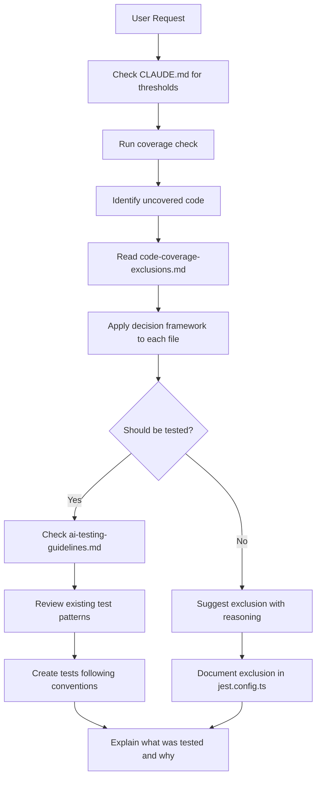
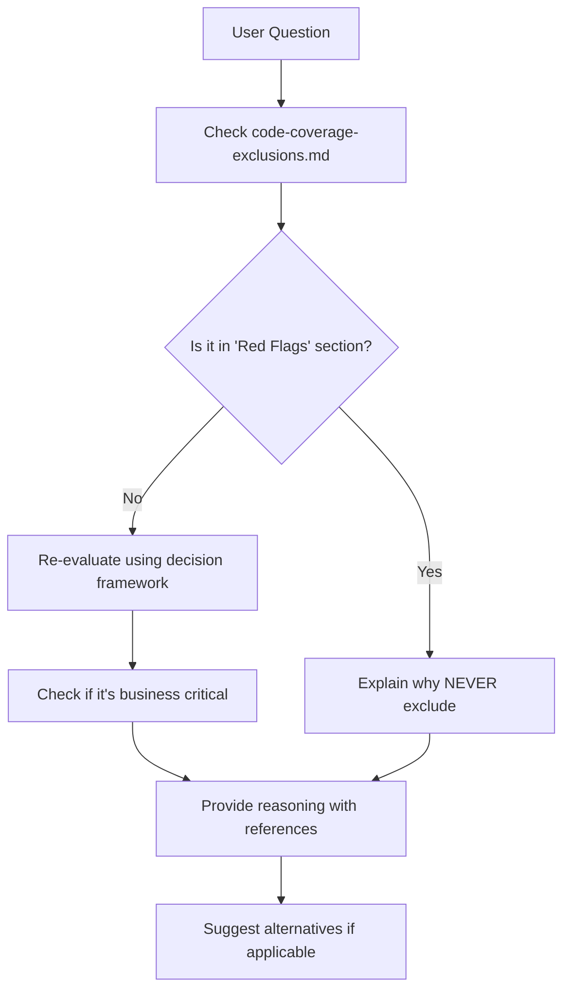
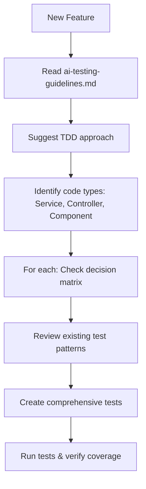

# Testing Context Overview

## How AI Context Uses Coverage Guidelines

This document explains how the AI assistant (Claude) uses the testing documentation when working on this codebase.

## The Documentation System

### 1. CLAUDE.md (Entry Point)

The `CLAUDE.md` file is **always loaded** when an AI assistant starts working in this repository. It now includes a **Testing & Coverage** section that:

1. States the coverage thresholds (80% statements/lines, 60% branches/functions)
2. Points to the two key documents:
   - `documents/code-coverage-exclusions.md` - **WHAT** to test vs. exclude
   - `documents/ai-testing-guidelines.md` - **HOW** AI should make decisions

3. Lists key principles that should guide all testing decisions

### 2. Code Coverage Exclusions (The Rules)

**File**: `documents/code-coverage-exclusions.md`

**Purpose**: Defines the rules for humans AND AI about what code should/shouldn't be tested

**When AI Uses This**:

- Before writing any tests
- When asked to improve coverage
- When considering excluding code from coverage
- When user questions an exclusion decision

**Key Sections**:

- **Decision Framework**: 6-step process to determine if code should be excluded
- **Decision Tree**: Visual flowchart for quick decisions
- **Red Flags**: What should NEVER be excluded
- **Best Practices**: How to document exclusions
- **Current Exclusions**: What's already excluded in each package

### 3. AI Testing Guidelines (The Process)

**File**: `documents/ai-testing-guidelines.md`

**Purpose**: Explains **how** the AI should apply the coverage exclusion rules in practice

**When AI Uses This**:

- When creating new tests
- When analyzing coverage gaps
- When user asks "why not exclude X?"
- When debugging test failures

**Key Sections**:

- **Workflow**: Step-by-step process for creating tests
- **Decision Matrix**: Quick reference table for common code types
- **Common Pitfalls**: What to avoid (with examples from our history)
- **Example Scenarios**: Real-world examples of good/bad decisions

## How It Works in Practice

### Scenario 1: User Asks to Improve Coverage

**User**: "improve coverage for web-ui"

**AI Process**:



**AI Response**:

```
I'll analyze web-ui coverage. Current: 78%, Target: 80%

Checking code-coverage-exclusions.md for guidelines...

Uncovered files:
1. theme.service.ts
   - Decision: MUST TEST (business logic, state management)
   - Per guidelines: ❌ NOT infrastructure, ❌ NOT presentational

2. header.component.ts
   - Decision: CONSIDER EXCLUSION (mostly presentational)
   - Per guidelines: ✅ Presentational component with minimal logic

3. message.service.ts
   - Decision: MUST TEST (business logic wrapper)
   - Per guidelines: ❌ Contains logic beyond simple framework calls

Strategy:
- Write tests for #1 and #3 (expected +5% coverage)
- Exclude #2 with documentation
- This should bring us to ~83% coverage

Let me start with theme.service.ts tests...
```

### Scenario 2: User Questions an Exclusion

**User**: "why not exclude the auth service?"

**AI Process**:



**AI Response**:

```
According to documents/code-coverage-exclusions.md,
auth services are explicitly listed under "Red Flags - When NOT to Exclude":

❌ DO NOT EXCLUDE:
   "Authentication/Authorization code - Security-critical code must be tested"

Reasoning:
1. Security bugs can have severe consequences
2. Auth logic contains complex business rules
3. It's testable with mocked dependencies

Instead of excluding, I recommend:
- Mock external auth providers
- Test the business logic in isolation
- Add integration tests for the full flow

Would you like me to show you how to test it?
```

### Scenario 3: Creating Tests for New Feature

**User**: "I'm adding a subscription feature"

**AI Process**:



**AI Response**:

```
Per ai-testing-guidelines.md, for new features I recommend TDD.

Based on the decision matrix:
✅ SubscriptionService - MUST TEST (business logic)
✅ SubscriptionController - MUST TEST (API contract)
✅ SubscriptionMapper - MUST TEST (data transformation)
❌ WebSocket connection - Consider excluding (infrastructure)

I'll create tests following the pattern in existing services.
Let me start with subscription.service.spec.ts...

[Creates test file]

This follows our testing conventions:
- Jest syntax (jest.fn(), mockImplementation())
- Comprehensive coverage (happy path + edge cases + errors)
- Focuses on business logic, not framework features
```

## Real Example from Our History

Here's how this system would have worked with our actual conversation:

### What Happened

1. **User**: "suggest a code coverage solution"
2. **AI Initial Approach**: Lowered thresholds to 55% (❌ wrong)
3. **User Feedback**: "no, don't lower the threshold solve the problem"
4. **AI Correction**: Reverted and properly excluded infrastructure
5. **AI Suggestion**: Exclude health endpoint
6. **User Pushback**: "why exclude it? why is it difficult to write tests"
7. **AI Correction**: Removed exclusion, wrote tests

### How It Would Work Now

With the new documentation system:

1. **AI reads CLAUDE.md** → Sees "NEVER exclude business logic"
2. **AI reads code-coverage-exclusions.md** → Health endpoint is API contract = business logic
3. **AI decision**: Write tests, not exclude
4. **Result**: No back-and-forth, correct decision from the start

## Benefits of This System

### For AI Assistants

✅ **Clear guidelines** on when to test vs. exclude
✅ **Reference examples** from actual project decisions
✅ **Process to follow** reducing guesswork
✅ **Quick decision matrix** for common scenarios
✅ **Learn from past mistakes** (documented in guidelines)

### For Developers

✅ **Consistent decisions** across different AI sessions
✅ **Documented reasoning** for all exclusions
✅ **Faster development** - AI makes correct choices immediately
✅ **Better code quality** - focus on testing what matters
✅ **Easy to update** - modify one document, affects all future AI interactions

### For the Codebase

✅ **High-quality test coverage** of critical code
✅ **Pragmatic exclusions** of low-value tests
✅ **Maintainable test suite** - no brittle infrastructure tests
✅ **Clear separation** between unit and integration testing
✅ **Consistent patterns** across all packages

## How to Update the Guidelines

If you discover the guidelines are wrong or incomplete:

1. **Update** `documents/code-coverage-exclusions.md` with new rules
2. **Update** `documents/ai-testing-guidelines.md` with new examples
3. **Update** `CLAUDE.md` if thresholds or principles change
4. **Document** the reason for the change

The AI will automatically use the updated guidelines in future sessions.

## Key Files Reference

| File                                    | Purpose                     | When to Read                        |
| --------------------------------------- | --------------------------- | ----------------------------------- |
| `CLAUDE.md`                             | Entry point, overview       | Always loaded                       |
| `documents/code-coverage-exclusions.md` | Rules for what to test      | Before creating tests or exclusions |
| `documents/ai-testing-guidelines.md`    | How AI should apply rules   | When creating tests                 |
| `jest.preset.js`                        | Global coverage config      | When changing thresholds            |
| `[package]/jest.config.ts`              | Package-specific exclusions | When excluding files                |
| `.codecov.yml`                          | Codecov configuration       | When using cloud coverage           |

## Example AI Decision Log

Here's what an AI assistant might think through:

```
User asks: "improve coverage for web-ui"

Step 1: Check CLAUDE.md
- Threshold: 80% statements/lines ✓
- Need to read exclusion guidelines ✓

Step 2: Run coverage check
- Current: 78% statements
- Gap: 2% needed

Step 3: Read code-coverage-exclusions.md
- Understand decision framework ✓
- Review red flags (never exclude) ✓

Step 4: Analyze uncovered files
- theme.service.ts: Business logic → MUST TEST
- header.component.ts: Presentational → CAN EXCLUDE
- message.service.ts: Logic wrapper → MUST TEST

Step 5: Read ai-testing-guidelines.md
- Check decision matrix ✓
- Review test patterns ✓
- Understand common pitfalls ✓

Step 6: Make plan
- Write theme + message tests (est. +5%)
- Exclude header component (documented)
- Expected result: ~83% coverage

Step 7: Execute
- Create tests following project conventions
- Update jest.config.ts with exclusion
- Document reasoning

Step 8: Explain to user
- Show coverage improvement
- Explain exclusion reasoning
- Reference guidelines used
```

## Conclusion

This documentation system ensures that AI assistants make **informed, consistent, and correct** decisions about code coverage and testing. The guidelines are based on real project experience and can evolve as the project grows.

The key principle remains: **Test business logic, exclude infrastructure, and always explain your reasoning.**
